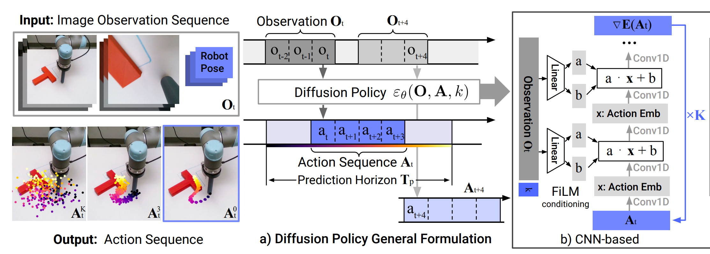

# Training Diffusion Policies on Robot Grasps with Force-Feedback

Robot foundation models (see: RT family models, Octo, OpenVLA, Embodied Chain-of-Thought, TinyVLA) leverage large-scale datasets spanning diverse objects, scenes, and embodiments to produce generalizable, cross-platform robot policies. The utilized data adheres to limited modalities: vision, language, and robot action&mdash;most typically, workspace camera view, text annotation of a given task, end-effector pose, and binary (open or closed) gripper position. 

The latter modality, binary gripper position, especially without force feedback, precludes robot foundation models from successfully grasping many delicate objects such as soft produce, brittle dried goods, paper containers, and other such fragile and deformable items. In this article, I propose a modification to this archetypal structure: continuous, rather than binary, gripper positions and corresponding grasp force feedback.

I'll prove it out with a custom dataset of 130 successful move-and-pick trajectories on 30 unique objects and diffusion policies. Diffusion policy (DP) is a model architecture in the family of behavior cloning (BC) or imitation learning (BL) methods (see: action chunking transformers, behavior transformers). 

Diffusion policy differs from transformer-based BC methods because rather than producing robot actions from autoregresive next-token decoding, DP starts from noise and, conditioning on the robot's observation of the world (including images, robot action, text, etc...), learns the denoising steps to produce valid robot actions with a U-Net core (there is also a transformer-based DP architecture, but that is out of the scope of this article). There's a lot to dive into, so let's break it down. 

This article is organized as such: from the bottom (model architecture) to top (data collection):

1. Fine-grained step-by-step look at the core Diffusion Policy model architecture, from observation to action.
2. Policy evaluation (WIP)
3. Adapting the trajectory data from the Reinforcement Learning Dataset (RLDS) format for DROID Policy Training (the policy training wrapper used by the creators of the DROID dataset) to configure multiple data configurations for training. (WIP)
4. Describing the method of data collection and measuring force feedback. (WIP)

No all-in-one notebook for this one, but I have provided all code, data, and models required to replicate this work at the bottom of the article.

## Environment Configuration
Follow the instructions in the [DROID Policy Learning repo](https://github.com/badinkajink/deligrasp_policy_learning):

0. Clone this repo and cd in.
1. Create python 3.10 conda environment: `conda create --name droid_policy_learning_env python=3.10`
2. Activate the conda environment: `conda activate droid_policy_learning_env`
3. Install [octo](https://github.com/octo-models/octo/tree/main), pinned at commit `85b83fc19657ab407a7f56558a5384ae56fe453b` (used for data loading)
4. Run `pip install -e .` in `droid_policy_learning`.

How to install octo at a pinned commit:
1. Clone the octo repo.
2. `git reset --hard 85b83fc`
3. pip install -e .
4. pip install -r requirements.txt

## Diffusion Policy
 

First off, some links for your reference:
   - [The original diffusion policy paper](https://diffusion-policy.cs.columbia.edu/diffusion_policy_2023.pdf)
   - [The original diffusion policy repo](https://github.com/real-stanford/diffusion_policy)
   - [The DROID implementation of DP](https://github.com/droid-dataset/droid_policy_learning/blob/master/robomimic/algo/diffusion_policy.py)
   - [The Medium article this section is inspired by](https://radekosmulski.com/diving-into-diffusion-policy-with-lerobot/)

Three key parameters to keep in mind going forward are:

1. `T_o`: The observation horizon, or how many past observations we use for training. DP conditions on robot observations, which span backwards in time from the current *n*th observation to the observation at the *n*th - `T_o` timestep. We set `T_o` to `2`.
2. `T_a`: The action horizon, or how many actions we'll rollout (read: execute, evaluate, plan motion for, etc...) before re-observing the next `T_o` and predicting the next `T_a`. We set `T_a` to `8`.
3. `T_p`: The prediction horizon is the number of future actions the DP will generate from noise. When training, we take train from the current action to the `T_p`th, and when evaluating, we generate a noise-trajectory of `T_p` steps, and apply the learned denoising to get trajectory steps. We set `T_p` to 16.

### Data Overview
Observations are ~5Hz samples, or `steps` of robot state (`observation`: two images, a 16-dimension `state` Tensor enumerated as a 6DoF end-effector pose, 6DoF UR5 joint position, and gripper position, applied force, and contact force) and expected action (`action`, enumerated in `action_dict`). Looks like this:
```
'steps': tfds.features.Dataset({
    'observation': tfds.features.FeaturesDict({
        'image': tfds.features.Image(
            shape=(3, 128, 128), doc='Main camera RGB observation.',),
        'wrist_image': tfds.features.Image(
            shape=(3, 128, 128), doc='Wrist camera RGB observation.',),
        'state': tfds.features.Tensor(
            shape=(9,),
            doc='Robot state, consists of [6x end-effector position (x,y,z,rx,ry,rz relative to base frame), 1x gripper position, 1x gripper applied force, 1x gripper contact force].'),
        'ee_pose': tfds.features.Tensor(
            shape=(6,), doc='6x end-effector pose (x,y,z,rx,ry,rz relative to base frame)',),
        'gripper_position': tfds.features.Tensor(
            shape=(1,),doc='gripper position',),
        'applied_force': tfds.features.Tensor(
            shape=(1,),doc='gripper applied force',),
        'contact_force': tfds.features.Tensor(
            shape=(1,),doc='gripper measured contact force',),
    }),
    'action': tfds.features.Tensor(
        shape=(9,),
        doc='Robot action, consists of delta values across [6x ee pos (x, y, z, r, p, y), 1x delta gripper position, 1x delta gripper applied force, 1x terminate episode].',
    ),
    'action_dict': tfds.features.FeaturesDict({
        'translation': tfds.features.Tensor(
            shape=(3,), doc='end effector translation delta, relative to base frame', ),
        'rotation': tfds.features.Tensor(
            shape=(3,), doc='end effector rotation delta, relative to base frame'),
        'gripper_position': tfds.features.Tensor(
            shape=(1,), doc='gripper position delta.',),
        'gripper_force': tfds.features.Tensor(
            shape=(1,), doc='gripper force delta.',),
    }),
    'language_instruction': tfds.features.Text(
        doc='Language Instruction.'),
})
```

Each episode or trajectory is a collection of steps in which the robot moves to an object, grasps it, and successfully moves back home. Each `action` is a relative quantity, i.e. a small delta applied to applicable values in current robot state (`observation`).

### Input Processing
We are now looking at `robomimic/models/obs_nets.py:ObservationGroupEncoder`, , viewable at [my adaptation of the DROID Policy Learning repo](https://github.com/badinkajink/deligrasp_policy_learning) or the original repo.

The `observation`, unprocessed, is quite disparate. We'll need to reshape two images, a 6D end-effector pose, and three different gripper values into one nice input to the model. 

The key is in the ObservationGroupEncoder (`robomimic/models/obs_nets.py:ObservationGroupEncoder`), which takes in six  `(16, 2, N)` observations, where `16` is the batch size `B`, `2` is `T_o`, and `N` is the unencoded input with shapes `(3, 128, 128)` for the two images, `(6)` for the end effector pose (cartesian position + Euler `XYZ` orientation), and `(1)` for the three gripper states (`gripper_position`, `applied_force`, and `contact_force`).

First, we apply a random crop and color randomization to the images from `(3, 128, 128) --> (3, 116, 116)`. Then we pass the image through `resnet50` without its classification head and get a `512` channel feature map.

However, this is where the DROID implementation diverges from the vanilla DP configuration. The original DP then applies a SpatialSoftmax to this feature map to obtain `32` keypoints with softmax applied over each keypoint. These 32 keypoints correspond to regions of interest (`x,y` pairs) on the input image, but [SpatialSoftmax is disputed to actually obtain what we consider semantically significant keypoints](https://github.com/alexander-soare/little_experiments/blob/main/diffusion_spatial_softmax.md). By default, DROID opts out of SpatialSoftmax and we follow suit, keeping the 512-dimension feature map. 

Then, for `T_o`=2, and an observation containing 2 images (feature_dim=512 for each) and a 9D low-dim observation, I would typically expect a `(B, T_o, 1033)`-dim (512 + 512 + 9=1033) globally conditioned observation input, `global_cond`, to the U-net has dimension 1024. Why?

The ObservationGroupEncoder does initially create a `(B*T_o, 1033)`-dim input. However, in its forward pass, it applies three Linear layers to the data:
```
self.combine = nn.Sequential(
    nn.Linear(self.combo_output_shape(), 1024), # combo_output_shape: 1033 in our case
    nn.ReLU(),
    nn.Linear(1024, 512),
    nn.ReLU(),
    nn.Linear(512, self.out_size)
)
...
def forward(self, **inputs):
    ...
    # outputs = do(combine observation shapes in the ObservationGroupEncoder)
    ...
    combo = torch.cat(outputs, dim=-1)
    print(f"OGE: concatenated shape: {combo.shape}")
    out = self.combine(combo)
    print(f"OGE: final shape: {out.shape}")
    return out
---
$ OGE: concatenated shape: torch.Size([32, 1033])
$ OGE: final shape: torch.Size([32, 512])
```
### Diffusion Policy Batching
We are looking now at `robomimic/algo/diffusion_policy.py:DiffusionPolicyUNet`, viewable at [my adaptation of the DROID Policy Learning repo](https://github.com/badinkajink/deligrasp_policy_learning) or the original repo:

Finally, we convert from `(B * T_o, 512)` back to `(B, T_o, 512)`, and flatten this into a `(B, T_o * 512)` batch for training.

Diffusion policies generate, or rather denoise, an `action` from noise, conditioned on the `observation`. At the heart of a CNN-based DP is a 1D U-net, which takes an input action dimension and input observation dimension, and we also create a `noise_scheduler` which will apply noise to training data.

```
noise_pred_net = ConditionalUnet1D(
    input_dim=self.ac_dim,
    global_cond_dim=obs_dim*self.algo_config.horizon.observation_horizon
)

noise_scheduler = None
if self.algo_config.ddpm.enabled:
    noise_scheduler = DDPMScheduler(
        num_train_timesteps=self.algo_config.ddpm.num_train_timesteps,
        beta_schedule=self.algo_config.ddpm.beta_schedule,
        clip_sample=self.algo_config.ddpm.clip_sample,
        prediction_type=self.algo_config.ddpm.prediction_type
    )
```
Then in each forward pass, we sample and apply noise to the clean actions:
```
noise = torch.randn([num_noise_samples] + list(actions.shape), device=self.device)

# sample a diffusion iteration for each data point
timesteps = torch.randint(
    0, self.noise_scheduler.config.num_train_timesteps, 
    (B,), device=self.device
).long()

# add noise to the clean actions according to the noise magnitude at each diffusion iteration
# (this is the forward diffusion process)
noisy_actions = torch.cat([self.noise_scheduler.add_noise(
                actions, noise[i], timesteps)
                for i in range(len(noise))], dim=0)
```
Finally, we predict the noise residual and compute our L2 loss:
```
# predict the noise residual
noise_pred = self.nets['policy']['noise_pred_net'](
    noisy_actions, timesteps, global_cond=obs_cond)

# L2 loss
noise = noise.view(noise.size(0) * noise.size(1), *noise.size()[2:])
loss = F.mse_loss(noise_pred, noise)
```
### Unet
We are looking now at `robomimic/algo/diffusion_policy.py:ConditionalUnet`, , viewable at [my adaptation of the DROID Policy Learning repo](https://github.com/badinkajink/deligrasp_policy_learning) or the original repo.
We saw in the DP batching we were creating the noise prediction net:
```
noise_pred_net = ConditionalUnet1D(
    input_dim=self.ac_dim,
    global_cond_dim=obs_dim*self.algo_config.horizon.observation_horizon
)
```

Taking a closer look at `ConditionalUnet1D`, we see that we take the input `(B, T_o * 512)` and embed them with sinusoidal position embedding, with each integer expanded to 256 dimensions (`diffusion_step_embed_dim=256`).
```
dsed = diffusion_step_embed_dim
diffusion_step_encoder = nn.Sequential(
    SinusoidalPosEmb(dsed),
    nn.Linear(dsed, dsed * 4),
    nn.Mish(),
    nn.Linear(dsed * 4, dsed),
)
```
The positional embedding, rather than starting from random embeddings, is advantageous in that embeddings for adjacent timesteps are more similar in distance and direction, which is retained during training. But we then apply two linear layers to get a normal embedding. 

Now, we take our `cond_dim = dsed + global_cond_dim`, or `256 + 1024 = 1280`-dim vector and pass it into the down, middle, and upward residual blocks that make up the characteristic `U` shape of the `Unet`:
```
self.mid_modules = nn.ModuleList([
    ConditionalResidualBlock1D(
        mid_dim, mid_dim, cond_dim=cond_dim,
        kernel_size=kernel_size, n_groups=n_groups
    ),
    ConditionalResidualBlock1D(
        mid_dim, mid_dim, cond_dim=cond_dim,
        kernel_size=kernel_size, n_groups=n_groups
    ),
])
down_modules = nn.ModuleList([]) 
... instantiation
up_modules = nn.ModuleList([])
... instantiation
final_conv = nn.Sequential(
    Conv1dBlock(start_dim, start_dim, kernel_size=kernel_size),
    nn.Conv1d(start_dim, input_dim, 1),
)
```
Where the `input_dim` in the last `Conv1d` block is the resulting action prediction. In the forward pass of the Unet, we supply the `global_cond_dim=1024` to each call of each section of the Unet residual blocks.  
```
if global_cond is not None:
    global_feature = torch.cat([
        global_feature, global_cond
    ], axis=-1)

x = sample
h = [] # skip connections
for idx, (resnet, resnet2, downsample) in enumerate(self.down_modules):
    x = resnet(x, global_feature)
    x = resnet2(x, global_feature)
    h.append(x)
    x = downsample(x)

for mid_module in self.mid_modules:
    x = mid_module(x, global_feature)

for idx, (resnet, resnet2, upsample) in enumerate(self.up_modules):
    x = torch.cat((x, h.pop()), dim=1)
    x = resnet(x, global_feature)
    x = resnet2(x, global_feature)
    x = upsample(x)
    
x = self.final_conv(x)

# (B,C,T)
x = x.moveaxis(-1,-2)
# (B,T,C)
return x
```
Then we compute loss, as described in the subsection above, compute backprop, and train. We train our models for just 30 epochs (100 steps per epoch), and they are [available for download here](https://drive.google.com/drive/folders/1fvGMk5F-NcufhT3IpzY5lazck3oTlsoR?usp=sharing)
## Evaluating Trained Diffusion Policies (WIP)
We'll be looking at `examples/notebooks/run_dg_policy.ipynb` in [my adaptation of the DROID Policy Learning repo, used to load my data and train models](https://github.com/badinkajink/deligrasp_policy_learning):

We have our trained models. Now what? First, we load the model:
```
dg = "~/path/to/model_checkpoint.pth"
device = TorchUtils.get_torch_device(try_to_use_cuda=True)

# restore policy
policy, ckpt_dict = FileUtils.policy_from_checkpoint(ckpt_path=dg, device=device, verbose=True)
```
This will print out the training config and model card.

Then, we do the fun part: collecting an observation from the robot. Our model expects an observation input of two (128, 128) RGB `jpeg` encoded images, a end-effector pose (3D cartesian position and 3D Euler `XYZ` orientation), a gripper position, a gripper applied force, and gripper contact force. 

Now quickly go to your robot and get those values. Since this is the first observation, there is no past history. Since `T_o` is 2, we'll just double up on the first observation. You should have a dictionary, `obs_dict`, where each key corresponds to one of the observation types, and its value is the measured quantity, as such:
```
for key in obs_dict:
    print(f"key: {key}")
    print(f"shape: {obs_dict[key].shape})
key: robot_state/gripper_position
shape: torch.Size([1, 2, 1])
key: camera/image/varied_camera_1_left_image
shape: torch.Size([1, 2, 3, 128, 128])
key: camera/image/varied_camera_2_left_image
shape: torch.Size([1, 2, 3, 128, 128])
key: robot_state/applied_force
shape: torch.Size([1, 2, 1])
key: robot_state/contact_force
shape: torch.Size([1, 2, 1])
key: robot_state/cartesian_position
shape: torch.Size([1, 2, 6])
```

We add an extra dimension at the front for batching required data formats. You might ask, where is the language conditioning? The authors have hacked in an input to the DP, and requires that we create a `lang_command.txt` file in the same directory as the notebook, containing whatever commmand you want to enter.

Now we can get our policy rollout!
```
policy.start_episode()
policy.goal_mode = None
policy.action_queue = None
policy.eval_mode = True
policy(obs_dict)
```

And we get an action:
```
{'action/rel_pos': array([-0.01507424, -0.00389477, -0.00696873]), 'action/rel_rot_6d': array([-0.04011911, -0.07106104,  0.05214009], dtype=float32), 'action/gripper_position': array([0.01502148]), 'action/gripper_force': array([0.02163821])}
```

The `gripper_position` and `gripper_force` actions are not great--we don't want to be moving the gripper or applying any force on the first observation, as we are far away from whatever object we want to grasp and need to move there first. I explore how to improve this temporal inconsistency in the following section (WIP).

## Training Different Modalities with DROID Policy Training (WIP)
We'll be looking at the following files in [my adaptation of the DROID Policy Learning repo](https://github.com/badinkajink/deligrasp_policy_learning):
1. `robomimic/scripts/train.py`
2. `robomimic/utils/rlds_utils.py`
3. `robomimic/utils/file_utils.py`
4. `robomimic/scripts/config_gen/deligrasp_runs_language_conditioned_rlds.py`
5. `robomimic/scripts/config_gen/dg_noforce_runs_language_conditioned_rlds.py`
6. `robomimic/scripts/config_gen/dg_grasponly_runs_language_conditioned_rlds.py`
7. `robomimic/scripts/config_gen/dg_grasponly_noforce_runs_language_conditioned_rlds.py`
8. `robomimic/scripts/config_gen/helper.py`

The question, the critical question that must be answered: was it worth the effort integrating this toy dataset into this relatively large and complex DROID policy learning repo?
### **No**
## Force Feedback without Specialized Hardware (WIP)

The full [Grasp w/Force Feedback Dataset, with Full and Grasp Only Trajectories.](https://drive.google.com/drive/folders/1W5pKdqsiXAujO3R8qoVz0g2Y5Bv0nFxh?usp=sharing)


## Some best practices / tips

1. Restart all Jupyter kernels that you have imported torch in while training your models. For an unknown reason, having these loaded modules greatly increases GPU usage and training time (15-25x increase)
2. Make deepcopies of Realsense camera pipe frames if you are going to store them in a buffer.
3. [6D representations of 3D end-effector orientations](https://arxiv.org/abs/1812.07035)
4. DROID Datasets automatically remove spatial softmax, see `robomimic/scripts/config_gen/helper.py:138`. [SpatialSoftmax is disputed to obtain semantically significant keypoints](https://github.com/alexander-soare/little_experiments/blob/main/diffusion_spatial_softmax.md)

## Links
1. [Model Checkpoints](https://drive.google.com/drive/folders/1fvGMk5F-NcufhT3IpzY5lazck3oTlsoR?usp=sharing)
2. [Grasp w/Force Feedback Dataset, Full Trajectories and Grasp Only](https://drive.google.com/drive/folders/1W5pKdqsiXAujO3R8qoVz0g2Y5Bv0nFxh?usp=sharing). Extrac this to `~/tensorflow_datasets/` (create the folder there if you don't have it). If you don't want the folder there, specify a desired folder in `TFDS_DATA_DIR` in your `bashrc`.
3. [My adaptation of the DROID Policy Learning repo, used to load my data and train models](https://github.com/badinkajink/deligrasp_policy_learning)
4. [Direct link to DP evaluation/rollout notebook](https://github.com/badinkajink/deligrasp_policy_learning/blob/master/examples/notebooks/run_dg_policy.ipynb)

## Citations (WIP)